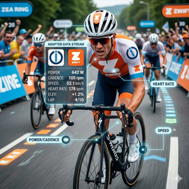

# ioBroker.zwift

**Tests:** 

## Zwift Adapter for ioBroker

Polls the Zwift API for live workout data and makes it available as ioBroker states. See your power, heart rate, cadence, speed, and more in real time while riding on Zwift.

### Features

- Live rider data updated every 5 seconds (configurable)
- Zwift profile information (name, weight, height, lifetime stats)
- Connection status indicator (`info.connection`)
- Automatic token refresh with re-authentication fallback
- Encrypted credential storage

### Configuration

| Setting | Description | Default |
|---------|-------------|---------|
| **Zwift Email** | Your Zwift account email | — |
| **Zwift Password** | Your Zwift account password (stored encrypted) | — |
| **Polling Interval** | How often to fetch data, in seconds (3–300) | 5 |

### States

#### Rider Data (updated every poll cycle)

| State | Unit | Description |
|-------|------|-------------|
| `isRiding` | — | `true` when actively in a Zwift world |
| `power` | W | Current power output |
| `heartrate` | bpm | Current heart rate |
| `cadence` | rpm | Current cadence |
| `speed` | km/h | Current speed |
| `distance` | km | Distance covered in current activity |
| `altitude` | m | Current altitude |
| `climbing` | m | Total elevation gain in current activity |
| `calories` | kcal | Calories burned |
| `time` | s | Elapsed ride time |
| `laps` | — | Laps completed |
| `progress` | % | Route progress |
| `sport` | — | Sport type (0 = cycling) |
| `groupId` | — | Group/event ID (0 = no group) |
| `x`, `y` | — | World position coordinates |
| `heading` | — | Direction of travel |
| `lean` | — | Lean angle |
| `watchingRiderId` | — | ID of the rider being watched |
| `rideOns` | — | Ride On count |
| `courseId` | — | Current course ID |
| `roadId` | — | Current road ID |

#### Profile Data (fetched once on connect)

| State | Unit | Description |
|-------|------|-------------|
| `profile.id` | — | Zwift player ID |
| `profile.firstName` | — | First name |
| `profile.lastName` | — | Last name |
| `profile.weight` | kg | Weight |
| `profile.height` | cm | Height |
| `profile.age` | — | Age |
| `profile.male` | — | Gender indicator |
| `profile.countryCode` | — | Country code |
| `profile.totalDistance` | km | All-time distance |
| `profile.totalDistanceClimbed` | m | All-time elevation gain |
| `profile.totalTimeInMinutes` | min | All-time ride time |
| `profile.totalWattHours` | Wh | All-time watt hours |
| `profile.totalExperiencePoints` | — | Total XP |
| `profile.achievementLevel` | — | Current level |
| `profile.currentActivityId` | — | Current activity ID |
| `profile.powerSource` | — | Power source type |

### How It Works

The adapter authenticates with the Zwift API using the same endpoint as the Zwift Companion app (`client_id=Zwift_Mobile_Link`). It polls the rider status via the game relay server, decodes the protobuf response, converts raw values to human-readable units, and updates the ioBroker state tree.

When you are not actively riding in Zwift, the adapter sets `isRiding` to `false` and continues polling without errors.

## Changelog
<!--
	Placeholder for the next version (at the beginning of the line):
	### **WORK IN PROGRESS**
-->

### 0.0.1 (2026-03-02)
* (Flixhummel) initial release

## License
MIT License

Copyright (c) 2026 Flixhummel <hummelimages@googlemail.com>

Permission is hereby granted, free of charge, to any person obtaining a copy
of this software and associated documentation files (the "Software"), to deal
in the Software without restriction, including without limitation the rights
to use, copy, modify, merge, publish, distribute, sublicense, and/or sell
copies of the Software, and to permit persons to whom the Software is
furnished to do so, subject to the following conditions:

The above copyright notice and this permission notice shall be included in all
copies or substantial portions of the Software.

THE SOFTWARE IS PROVIDED "AS IS", WITHOUT WARRANTY OF ANY KIND, EXPRESS OR
IMPLIED, INCLUDING BUT NOT LIMITED TO THE WARRANTIES OF MERCHANTABILITY,
FITNESS FOR A PARTICULAR PURPOSE AND NONINFRINGEMENT. IN NO EVENT SHALL THE
AUTHORS OR COPYRIGHT HOLDERS BE LIABLE FOR ANY CLAIM, DAMAGES OR OTHER
LIABILITY, WHETHER IN AN ACTION OF CONTRACT, TORT OR OTHERWISE, ARISING FROM,
OUT OF OR IN CONNECTION WITH THE SOFTWARE OR THE USE OR OTHER DEALINGS IN THE
SOFTWARE.
